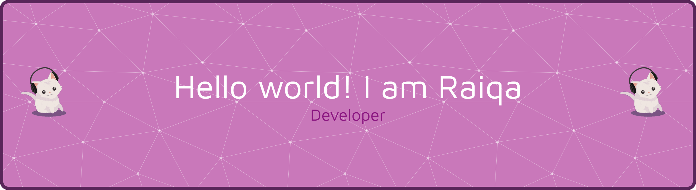

<!-- ## Hi there, I'm Dhaifina Raiqa Zahira👋 -->

<!-- **raiqazahira/raiqazahira** is a ✨ _special_ ✨ repository because its `README.md` (this file) appears on your GitHub profile.

Here are some ideas to get you started: -->
<!-- 
- 🔭 I’m currently working on ...
- 🌱 I’m currently learning ...
- 👯 I’m looking to collaborate on ...
- 🤔 I’m looking for help with ...
- 💬 Ask me about ...
- 📫 How to reach me: ...
- 😄 Pronouns: ...
- ⚡ Fun fact: ... -->

<h3 align="center
">Connect with me:</h3>

<h3 align="center
" width="100%">Languages and Tools:</h3>

       

    

  
   
  
   
   

<picture>
  <source media="(prefers-color-scheme: dark)" srcset="https://raw.githubusercontent.com/raiqazahira/raiqazahira/output/pacman-contribution-graph-dark.svg">
  <source media="(prefers-color-scheme: light)" srcset="https://raw.githubusercontent.com/raiqazahira/raiqazahira/output/pacman-contribution-graph.svg">
  
</picture>

###